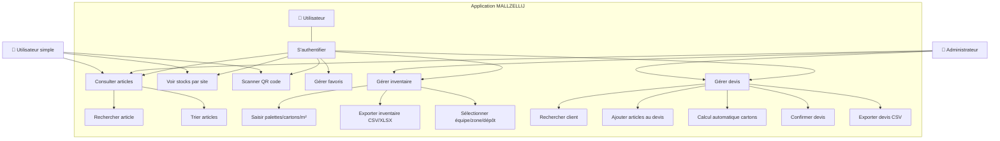
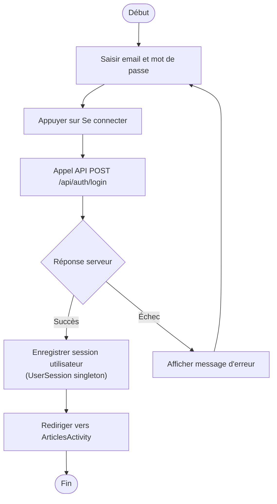
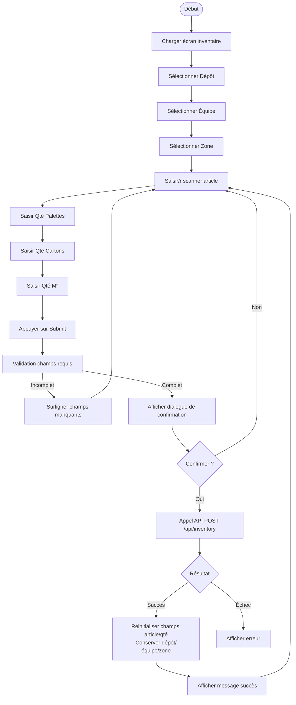
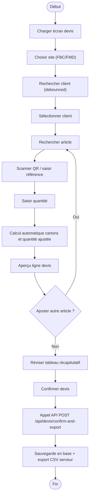
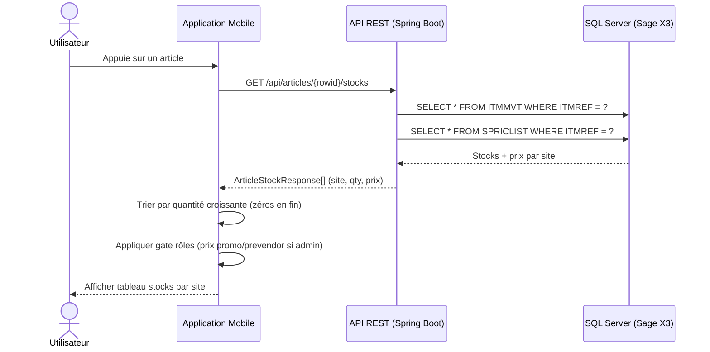
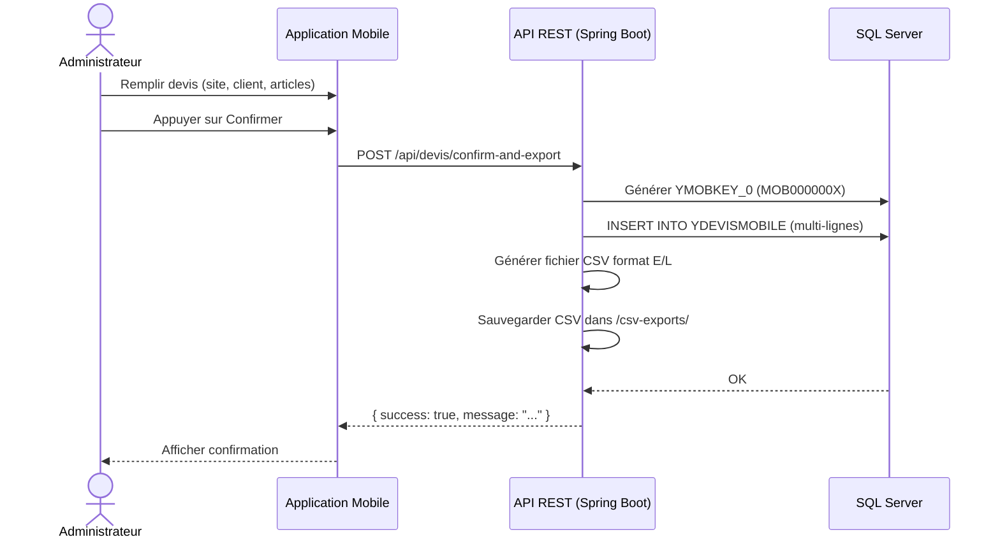
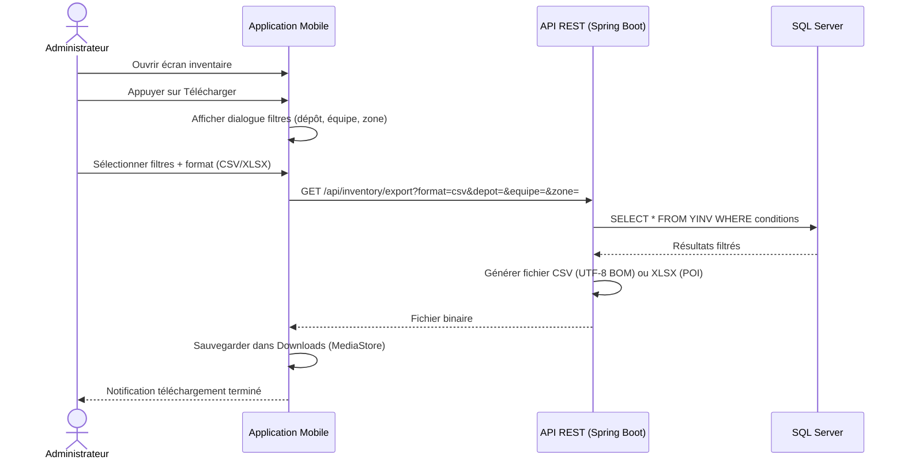

# Projet MALLZELLIJ — Application Mobile de Gestion des Articles et des Stocks

**Stagiaire :** Abdelkarim Erraji  
**Entreprise :** MALLZELLIJ — Importation et vente de zellige  
**École :** EMSI — 4ème année Ingénierie Informatique et Réseaux  
**Période :** 22 juillet 2026 – 1er août 2026  

---

## Table des matières

1. [Présentation du projet](#1-présentation-du-projet)
2. [Dimension entrepreneuriale](#2-dimension-entrepreneuriale)
3. [Dimension technologique](#3-dimension-technologique)
4. [Dimension conception](#4-dimension-conception)
   - 4.1 Diagramme de cas d'utilisation
   - 4.2 Diagramme d'activités
   - 4.3 Diagramme de séquence
5. [Architecture technique](#5-architecture-technique)
6. [Fonctionnalités détaillées](#6-fonctionnalités-détaillées)

---

## 1. Présentation du projet

**MALLZELLIJ** est une entreprise spécialisée dans l'importation et la vente de zellige (carreaux de mosaïque marocaine). Elle s'approvisionne auprès de fournisseurs internationaux (Turquie, Espagne) et commercialise sur le marché marocain.

### Problématique métier

L'entreprise utilise **Sage X3 v11** comme ERP pour gérer ses articles (ITMMASTER), ses stocks (ITMMVT), ses clients (BPCUSTOMER) et ses prix (SPRICLIST). Cependant, les équipes terrain (magasiniers, commerciaux) n'avaient **aucun accès mobile** à ces données. Les opérations d'inventaire et de devis étaient réalisées manuellement sur papier, avec des saisies diffées sources d'erreurs.

### Solution développée

Une **application mobile** (Android + Flutter) connectée via une **API REST Spring Boot** à la base **SQL Server** de Sage X3, permettant :

- 🔍 Consultation et recherche d'articles par nom ou QR code
- 📦 Visualisation des stocks par site avec prix (standard, promo, pré-vendeur)
- 📋 Réalisation d'inventaires (palettes, cartons, m²) par dépôt/équipe/zone
- 📄 Création et confirmation de devis multi-articles
- 📤 Export CSV/XLSX compatible Sage X3

---

## 2. Dimension entrepreneuriale

### 2.1 Contexte business

| Aspect | Description |
|---|---|
| **Activité** | Importation et vente de zellige |
| **Clients** | Artisans, architectes, promoteurs immobiliers, particuliers |
| **Fournisseurs** | Turquie, Espagne |
| **ERP** | Sage X3 v11 (historique) |
| **Besoin** | Digitaliser la gestion terrain des stocks et devis |

### 2.2 Valeur ajoutée pour l'entreprise

1. **Gain de temps** : recherche d'articles en 2 secondes via QR code vs consultation manuelle
2. **Fiabilité** : saisie terrain immédiate, suppression des doubles saisies papier
3. **Réactivité commerciale** : devis générés depuis le terrain, exportés directement dans Sage X3
4. **Traçabilité** : chaque inventaire est horodaté et signé par utilisateur
5. **Coût** : solution légère (smartphone Android existant), pas d'investissement lourd

### 2.3 Modèle économique

| Poste | Impact |
|---|---|
| **Investissement** | Un serveur VM Windows + développement (stage) |
| **Économies** | Saisie papier éliminée → ~10h/semaine réaffectées |
| **ROI** | Réduction des erreurs de stock → ~5% de pertes en moins |
| **Scalabilité** | Application déployable sur tous les smartphones Android de l'équipe |

---

## 3. Dimension technologique

### 3.1 Stack technique

```
┌─────────────────────────────────────────────────────────────┐
│                   APPLICATIONS MOBILES                       │
│  ┌─────────────────────┐    ┌──────────────────────────┐    │
│  │   Android (Java)    │    │   Flutter (Dart)         │    │
│  │   Retrofit + OkHttp │    │   http package           │    │
│  │   ZXing QR scan     │    │   mobile_scanner         │    │
│  │   Material Design 3 │    │   open_file              │    │
│  └─────────┬───────────┘    └───────────┬──────────────┘    │
│            │         HTTP JSON          │                   │
│            └──────────────┬──────────────┘                   │
└───────────────────────────┼─────────────────────────────────┘
                            │
┌───────────────────────────┼─────────────────────────────────┐
│              API REST (Spring Boot)                         │
│  ┌──────────┐ ┌──────────┐ ┌──────────┐ ┌──────────────┐  │
│  │  Auth    │ │ Article  │ │ Devis    │ │ Inventory    │  │
│  │Controller│ │Controller│ │Controller│ │Controller    │  │
│  └────┬─────┘ └────┬─────┘ └────┬─────┘ └──────┬───────┘  │
│       │            │            │              │           │
│  ┌────┴────────────┴────────────┴──────────────┴───────┐  │
│  │           Services / Repositories / JPA             │  │
│  └─────────────────────────┬───────────────────────────┘  │
└────────────────────────────┼──────────────────────────────┘
                             │ JDBC / jTDS
┌────────────────────────────┼──────────────────────────────┐
│              SQL Server (Sage X3 v11)                      │
│  ┌──────────┐ ┌──────────┐ ┌──────────┐ ┌──────────────┐  │
│  │ITMMASTER │ │ ITMMVT   │ │BPCUSTOMER│ │ SPRICLIST    │  │
│  │ (articles)│ │ (stocks) │ │ (clients)│ │ (prix)       │  │
│  └──────────┘ └──────────┘ └──────────┘ └──────────────┘  │
│  ┌──────────┐ ┌──────────┐ ┌──────────┐                   │
│  │YMOBILE   │ │YDEVISMOBILE│ │ YINV    │                   │
│  │(users)   │ │ (devis)  │ │ (invent.)│                   │
│  └──────────┘ └──────────┘ └──────────┘                   │
└────────────────────────────────────────────────────────────┘
```

### 3.2 Technologies utilisées

| Technologie | Rôle | Justification |
|---|---|---|
| **Java 17 + Spring Boot 3.4** | Backend REST | Maturité, écosystème, sécurité, JPA |
| **Android (Java + Retrofit)** | App native | Présent sur tous les terminaux de l'équipe |
| **Flutter (Dart)** | App cross-platform | Alternative iOS/Web, rapidité de développement |
| **SQL Server (Sage X3 v11)** | Base de données | ERP existant de l'entreprise |
| **jTDS** | Connecteur JDBC | Compatibilité SQL Server éprouvée |
| **ZXing Embedded** | Scanner QR | Intégration Android native |
| **Apache POI** | Export XLSX | Génération de fichiers Excel structurés |
| **BCrypt** | Sécurité | Chiffrement des mots de passe |

### 3.3 Contraintes techniques relevées

| Défi | Solution |
|---|---|
| Base Sage X3 non accessible depuis l'extérieur | VM Windows sur le réseau local, pas d'exposition Internet |
| Connexion appareil physique → VM | Création d'un Android VM secondaire, connexion ADB via IP |
| Synchronisation des données Sage X3 | Lecture directe des tables ITMMASTER/ITMMVT ; écriture dans tables dédiées Y* |
| Volumétrie des en-têtes HTTP | Augmentation maxHttpHeaderSize → 65536 bytes dans Tomcat |
| Export CSV compatible Sage X3 | Format E/L (En-tête/Ligne) avec clé mobile YMOBKEY_0 |

---

## 4. Dimension conception

### 4.1 Diagramme de cas d'utilisation



**Acteurs :**
- **Utilisateur** : toute personne authentifiée
- **Administrateur** : accès complet (articles + inventaire + devis + export)
- **Utilisateur simple** : consultation articles et stocks uniquement

**Cas d'utilisation principaux :**

| CU | Description | Acteurs |
|---|---|---|
| S'authentifier | Connexion avec email/mot de passe via `POST /api/auth/login` | Tous |
| Consulter articles | Liste avec recherche, tri, indicateur de stock | Tous |
| Voir stocks par site | Détail par site (FBC, FMD) avec prix selon rôle | Tous |
| Scanner QR code | Recherche instantanée d'article par code-barres/EAN | Tous |
| Gérer favoris | Marquer/retirer des articles favoris (SharedPreferences) | Tous |
| Gérer inventaire | CRUD inventaire avec saisie palettes/cartons/m² | Admin |
| Exporter inventaire | Télécharger CSV (UTF-8 BOM) ou XLSX filtré | Admin |
| Gérer devis | Création multi-articles, confirmation, export E/L CSV | Admin |
| Rechercher client | Autocomplétion via `GET /api/devis/clients?q=` | Admin |

### 4.2 Diagramme d'activités

#### Activité : Authentification



#### Activité : Création d'inventaire



#### Activité : Création de devis



### 4.3 Diagramme de séquence

#### Cas : Consultation des stocks d'un article



#### Cas : Confirmation de devis avec export



#### Cas : Export inventaire avec filtres



---

## 5. Architecture technique

### 5.1 Modèle de données

```
┌─────────────────────────────────────────────────────────────┐
│                   ITMMASTER (Sage X3)                       │
├─────────────────────────────────────────────────────────────┤
│ ROWID (PK), ITMREF_0, ITMDES1_0, ITMDES2_0, ITMDES3_0     │
│ EANCOD_0, SAU_0, PCUSTUCOE_0 (coeff), TCLCOD_0 (color)     │
│ YFinition_0, YCalibre_0                                     │
└───────────────────────────────┬─────────────────────────────┘
                                │ 1
                                │
                ┌───────────────┼───────────────┐
                │               │               │
                ▼               ▼               ▼
┌──────────────────────────┐ ┌──────────────┐ ┌──────────────┐
│ ITMMVT (Sage X3)         │ │ SPRICLIST    │ │ YDEVISMOBILE │
├──────────────────────────┤ ├──────────────┤ ├──────────────┤
│ ROWID (PK)               │ │ ROWID (PK)   │ │ ROWID (PK)   │
│ ITMREF_0 (FK→ITMMASTER)  │ │ ITMREF_0 (FK)│ │ YSITE_0      │
│ STOFCY_0 (site)          │ │ PLI_0        │ │ YBPCNUM_0    │
│ PHYSTO_0 (stock physique) │ │ PLICRD_0     │ │ YITMREF_0    │
│ PHYALL_0 (stock alloué)  │ │ PLICRI2_0    │ │ YQTY_0       │
│ AVC_0 (coût moyen)       │ │ PRI_0 (prix) │ │ YPRICE_0     │
└──────────────────────────┘ └──────────────┘ │ YMOBKEY_0    │
                                              └──────────────┘
┌─────────────────────────────────────────────────────────────┐
│ YINV (Inventaire)                  YMOBILE (Utilisateurs)   │
├───────────────────────────────────┬─────────────────────────┤
│ ROWID (PK)                        │ ROWID (PK)              │
│ YNUM_0 (num inventaire)           │ YLOGIN_0, YPASS_0       │
│ YDEPOT_0, YEQUIPE_0, YZONE_0      │ YID_0, YROLE_0          │
│ YITMREF_0 (FK→ITMMASTER)          │ (admin/user1)           │
│ YQTYPLT_0 (palettes)              │                         │
│ YQTYCRT_0 (cartons)               │                         │
│ YQTYMTR_0 (mètres carrés)         │                         │
│ CREDATTIM_0, AUUID_0, CREUSR_0    │                         │
└───────────────────────────────────┴─────────────────────────┘
```

### 5.2 Endpoints API REST

| Méthode | Endpoint | Description |
|---|---|---|
| `POST` | `/api/auth/login` | Authentification |
| `GET` | `/api/articles` | Liste tous les articles |
| `GET` | `/api/articles/search?q=` | Recherche par description |
| `GET` | `/api/articles/barcode/{ean}` | Recherche par code-barres |
| `GET` | `/api/articles/{rowid}/stocks` | Stocks + prix par site |
| `POST` | `/api/inventory` | Créer inventaire |
| `GET` | `/api/inventory` | Liste inventaires |
| `GET` | `/api/inventory/article/{ref}` | Filtrer par article |
| `GET` | `/api/inventory/depot/{depot}` | Filtrer par dépôt |
| `GET` | `/api/inventory/export?format=csv\|xlsx` | Export avec filtres |
| `POST` | `/api/devis` | Créer ligne devis |
| `POST` | `/api/devis/confirm-and-export` | Confirmer + export CSV |
| `GET` | `/api/devis/clients?q=` | Rechercher clients |
| `GET` | `/api/devis/export` | Exporter tous les devis |

### 5.3 Sécurité

- **Authentification** : basée sur la table `YMOBILE` (login/password)
- **Rôles** : `admin` (accès complet) / `user1` (consultation uniquement)
- **Réseau** : application accessible uniquement sur le réseau local (VM Windows)
- **CORS** : ouvert pour développement (`CorsConfig`)
- **Mots de passe** : stockés hashés (BCrypt via `Spring Security Crypto`)

---

## 6. Fonctionnalités détaillées

### 6.1 Authentification et rôles

| Rôle | Articles | Stocks | QR Code | Favoris | Inventaire | Devis | Export |
|---|---|---|---|---|---|---|---|
| **admin** | ✅ | ✅ (tous prix) | ✅ | ✅ | ✅ | ✅ | ✅ |
| **user1** | ✅ | ✅ (prix standard) | ✅ | ✅ | ❌ | ❌ | ❌ |

### 6.2 Articles

- Liste avec scroll infini
- Barre de recherche avec debounce
- Scanner QR code intégré
- Tri : favoris en premier / stock disponible / alphabétique
- Indicateur de stock visuel (point vert/rouge)
- Bouton "Ajouter au devis"

### 6.3 Stocks par site

- Sites : FBC (Fès) et FMD (Mediouna)
- Affichage : stock physique, alloué, disponible
- Prix : Standard, Promo, Pré-vendeur (admin uniquement)
- Tri : quantité croissante, zéros en dernier

### 6.4 Inventaire

- Saisie : Dépôt + Équipe + Zone + Article (QR/saisie) + Palettes + Cartons + M²
- Champs fixes conservés après soumission (dépôt/équipe/zone)
- Dialogue de confirmation avant envoi
- Export : CSV (UTF-8 BOM) ou XLSX avec filtres
- Sauvegarde dans dossier Downloads

### 6.5 Devis

- Recherche client avec debounce (table `BPCUSTOMER`)
- Recherche article avec scan QR
- Calcul automatique : coefficient → cartons → quantité ajustée
- Tableau récapitulatif modifiable
- Confirmation → sauvegarde DB + export CSV format E/L
- Fichier CSV prêt pour import Sage X3

### 6.6 Intégration Sage X3

Le dossier `sage_x3/` contient les scripts 4GL pour l'import/export des devis :

- **`YDEVISMOBILE.imp`** : Parse le CSV E/L, valide les champs, crée les enregistrements
- **`YDEVISMOBILE.exp`** : Exporte les devis triés par clé mobile
- **`SAMPLE.csv`** : Exemple de fichier E/L avec 2 documents

Format CSV E/L :
```
E;;SITE;DOSSIER;;CLIENT_CODE;DATE;;SITE;CURRENCY;MOB_KEY
L;;ARTICLE_REF;UNIT;QTY;PRICE;MOB_KEY
```

---

## Conclusion

Le projet MALLZELLIJ démontre comment une **application mobile légère** peut s'intégrer à un **ERP existant (Sage X3)** pour digitaliser des processus terrain critiques. En combinant :

- **Conception UML rigoureuse** (cas d'utilisation, activités, séquence)
- **Architecture client-serveur moderne** (Android/Flutter + Spring Boot + SQL Server)
- **Approche entrepreneuriale** (ROI, gain de productivité, scalabilité)

La solution offre à l'entreprise un outil concret, opérationnel et immédiatement déployable, avec un impact mesurable sur la fiabilité des stocks, la rapidité des devis et la traçabilité des opérations.
